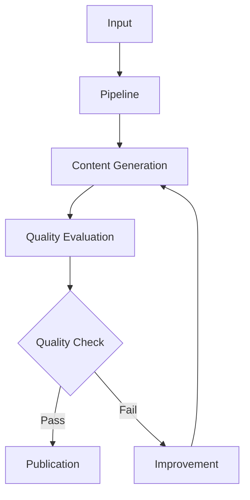

# Doc-Agent Architecture

## High-Level Architecture

### Top-Level Purpose
AI-powered documentation generation and evaluation system that combines LLMs with static analysis to create high-quality technical documentation, with focus on iterative improvement and quality metrics.

### Components & Responsibilities
| Component | Responsibility | Key Dependencies | Key Patterns/Interfaces |
|-----------|---------------|------------------|------------------------|
| `agent.py` | Core AI interaction orchestration | OpenAI API, evaluators | `EvalResult` type, Retry mechanism |
| `pipeline.py` | End-to-end doc processing flow | agent, evaluators, linters | Pipeline pattern, Error fallback |
| `agent_loop.py` | Iterative improvement cycle | OpenAI API, evaluators | State machine, Observer pattern |
| `evaluators/` | Quality assessment modules | OpenAI API (AI evaluators) | Strategy pattern, Factory pattern |
| `linters/` | Style and consistency checks | None (static analysis) | Visitor pattern |
| `draft.py` | Content generation | OpenAI API | Template pattern |
| `ingestion.py` | Input processing | None | Adapter pattern |
| `publish.py` | Output formatting | None | Builder pattern |

### Cross-Cutting Concerns
* **Configuration** 
  - Environment-based via python-dotenv
  - Default configs in code, overridable via env
  - Type: `Dict[str, Any]` for config objects

* **Logging** 
  - Centralized in `__main__.py`
  - Levels: DEBUG, INFO, WARNING, ERROR
  - Format: `%(message)s` for clean output
  - HTTP client logging controlled separately

* **Error Handling** 
  - Smart retry logic with `MAX_SAME_ERROR_ATTEMPTS = 3`
  - Error frequency tracking via Counter
  - Graceful fallbacks in pipeline
  - Type: `Dict[str, str]` for error objects

* **Quality Metrics** 
  - Common interface: `EvalResult(name: str, status: str, error: Optional[str])`
  - Scoring scales: 1-5 for AI evaluations
  - Boolean pass/fail for static checks
  - Aggregation strategy: fail-fast with collection

### Data Flow & State Management

1. Input Processing
   ```python
   Input -> Dict[str, Any] -> StructuredRequirements
   ```
   - Metadata extraction
   - Format validation
   - Requirements structuring

2. Content Generation
   ```python
   Requirements -> LLMPrompt -> Draft -> Improvements
   ```
   - Template selection
   - Context management
   - History tracking

3. Quality Assessment
   ```python
   Content -> List[Evaluator] -> List[EvalResult] -> Actions
   ```
   - Parallel evaluation
   - Result aggregation
   - Action determination

4. Improvement Loop
   ```python
   Results -> ErrorAnalysis -> Fixes -> NewDraft
   ```
   - Error prioritization
   - Fix generation
   - Progress tracking

### Key Interfaces & Types

1. **Evaluator Interface**
   ```python
   class Evaluator:
       def evaluate(text: str) -> EvalResult:
           pass
   ```

2. **Pipeline Types**
   ```python
   StructuredRequirements = Dict[str, Any]
   EvalResult = NamedTuple('EvalResult', [('name', str), ('status', str), ('error', Optional[str])])
   PipelineResult = Dict[str, Union[str, List[EvalResult], int]]
   ```

3. **Agent Types**
   ```python
   ErrorCounter = Counter[str]  # Tracks error frequencies
   EvaluatorSet = Set[str]     # Tracks passing evaluators
   ```

### Configuration Parameters

| Parameter | Type | Default | Description |
|-----------|------|---------|-------------|
| `MAX_SAME_ERROR_ATTEMPTS` | int | 3 | Max retries for same error |
| `DEFAULT_MAX_ITERATIONS` | int | 5 | Max improvement iterations |
| `EVALUATOR_REGISTRY` | Dict[str, Type[Evaluator]] | {...} | Available evaluators |
| `FORBIDDEN_FILE` | str | 'default_forbidden.txt' | Default forbidden words |

### Known Pain Points & Solutions

1. **AI Evaluator Latency**
   - Current: Sequential API calls
   - Solution: Implement parallel evaluation
   - Impact: High - affects overall performance
   - Type: Performance optimization

2. **Improvement Loops**
   - Current: Simple retry with counter
   - Solution: Implement smarter loop detection
   - Impact: Medium - affects reliability
   - Type: Algorithm improvement

3. **Evaluation Caching**
   - Current: No caching
   - Solution: Add LRU cache for evaluations
   - Impact: Medium - affects performance
   - Type: Feature addition

4. **Duplicate Logic**
   - Current: Separate linter/AI checks
   - Solution: Unified evaluation interface
   - Impact: Low - affects maintainability
   - Type: Refactoring

### Design Decisions & Rationale

1. **Pipeline Architecture**
   - Pattern: Linear pipeline with feedback
   - Why: Clear data flow, easy to modify
   - Alternative considered: Event-driven
   - Trade-off: Simplicity vs flexibility

2. **Agent-Based Design**
   - Pattern: Centralized agent with state
   - Why: Consistent AI interaction
   - Alternative considered: Distributed agents
   - Trade-off: Control vs scalability

3. **Modular Evaluators**
   - Pattern: Strategy with factory
   - Why: Easy to add new evaluators
   - Alternative considered: Monolithic
   - Trade-off: Complexity vs extensibility

### Future Considerations

1. **Performance Optimization**
   ```python
   # Current sequential:
   results = [evaluator(text) for evaluator in evaluators]
   
   # Future parallel:
   async with asyncio.TaskGroup() as group:
       tasks = [group.create_task(evaluator(text)) for evaluator in evaluators]
   results = [task.result() for task in tasks]
   ```

2. **Enhanced AI Integration**
   ```python
   # Future model configuration:
   ModelConfig = {
       'temperature': float,
       'top_p': float,
       'frequency_penalty': float,
       'presence_penalty': float
   }
   ```

3. **Extended Functionality**
   ```python
   # Future evaluator interface:
   class AdvancedEvaluator(Protocol):
       def evaluate(text: str) -> EvalResult: ...
       def suggest(text: str) -> List[Suggestion]: ...
       def explain(result: EvalResult) -> str: ...
   ```

## System Overview

Doc-Agent is built on a pipeline architecture that processes documentation through multiple stages of generation, evaluation, and refinement. The system uses both AI-powered components (via OpenAI's APIs) and traditional static analysis tools to ensure high-quality output.

## Core Components

### 1. Entry Point (`__main__.py`)

The main entry point for the application:
- Handles command-line arguments and subcommands (`generate` and `process`)
- Configures logging and verbosity levels
- Manages evaluator selection and configuration
- Provides development optimization flags (--no-eval, --fast)

### 2. Agent Implementation (`agent.py`)

Manages AI interactions and improvements:
- Implements intelligent retry logic with `MAX_SAME_ERROR_ATTEMPTS`
- Tracks evaluator status to skip already-passing checks
- Manages error message frequency to detect loops
- Provides detailed evaluation reporting

### 3. Pipeline Orchestration (`pipeline.py`)

Coordinates the documentation flow:


Key responsibilities:
- End-to-end document processing
- Fallback handling for errors
- Metadata management
- Output formatting

### 4. Processing Loop (`agent_loop.py`)

Handles the iterative improvement process:
- Combines LLM drafting with static heuristics
- Implements AI-lint fixes
- Manages evaluations (clarity, tone, empathy)
- Provides progress feedback and logging

### 5. Content Generation (`draft.py`)

Handles document creation:
- Implements scenario-based generation
- Supports style customization
- Handles previous content and fixes
- Controls API interactions

### 6. Tools and Utilities (`tools.py`)

Core functionality across the system:
- Linting implementations
- Fix suggestion generation
- Utility functions
- Common operations

### 7. Input Processing (`ingestion.py`)

Handles input and requirements:
- Parses source files
- Extracts metadata
- Validates input
- Prepares for processing

### 8. Document Structure (`outline.py`)

Manages documentation organization:
- Creates document skeletons
- Manages section hierarchy
- Controls document flow
- Handles templates

### 9. Publication (`publish.py`)

Handles output generation:
- Formats final content
- Supports multiple output formats (text, JSON)
- Manages file operations
- Controls publishing flow

### 10. Quality Components

#### Evaluators (`evaluators/`)
Multiple specialized evaluation modules:

1. **Heuristic Evaluator**
   - Forbidden word detection
   - Readability scoring
   - Pattern matching
   - Style compliance

2. **AI Evaluators**
   - Clarity and actionability assessment (1-5 scale)
   - Tone analysis with alignment check
   - Empathy scoring (1-5 scale)
   - Improvement suggestions

3. **Rubric Evaluator**
   - Documentation structure validation
   - Quality criteria checking
   - Format verification
   - Standard compliance

#### Linters (`linters/`)
Style and consistency enforcement:
- Documentation standards
- Format validation
- Structure verification
- Reference checking

## Data Flow

1. **Input Processing**
   ```
   User Input -> Ingestion -> Structured Requirements -> Pipeline
   ```

2. **Content Generation**
   ```
   Requirements -> Agent -> LLM -> Draft Content
   ```

3. **Quality Assessment**
   ```
   Content -> [Evaluators, Linters] -> Quality Metrics
   ```

4. **Improvement Cycle**
   ```
   Metrics -> Agent -> Improvements -> Updated Content
   ```

5. **Publication**
   ```
   Approved Content -> Formatting -> Final Output
   ```

## Design Decisions

### 1. Pipeline Architecture

**Decision**: Use a linear pipeline with feedback loops
**Rationale**: 
- Clear separation of concerns
- Easy to add new components
- Simple to understand and maintain
- Flexible improvement cycles

### 2. Agent-Based Design

**Decision**: Centralized agent management with smart retries
**Rationale**:
- Consistent AI interactions
- Intelligent retry logic
- Progress tracking
- Error detection and handling

### 3. Modular Evaluators

**Decision**: Separate evaluator types with common interface
**Rationale**:
- Mix of fast and AI-powered checks
- Easy to extend
- Configurable combinations
- Clear responsibilities

## Future Improvements

1. **Performance Optimization**
   - Parallel evaluations
   - Caching system
   - Batch operations
   - Resource management

2. **Enhanced AI Integration**
   - Multiple model support
   - Advanced prompting
   - Context optimization
   - Response improvement

3. **Extended Functionality**
   - New evaluators
   - Custom metrics
   - Additional formats
   - Integration options

## Security and Monitoring

1. **Security**
   - API key management
   - Input validation
   - Output safety
   - Access control

2. **Monitoring**
   - Performance tracking
   - Quality metrics
   - Usage statistics
   - Error monitoring

## Integration

1. **External Systems**
   - Version control
   - Documentation platforms
   - CI/CD systems
   - Monitoring tools

2. **APIs and Services**
   - OpenAI API
   - Custom services
   - Monitoring systems
   - Storage solutions 